# Fayfort Sourcing

> China-to-Africa sourcing with transparent landed costs. Estimate, request,
> quote, track — and talk to real people about it.

Fayfort is a sourcing platform that connects African importers with verified
China-based suppliers and managed logistics. The whole point is **transparency**:
before a customer commits, they see the supplier price, freight, insurance,
packaging, customs duty, clearance and a service fee itemised into a single
landed cost. Behind the scenes, a staff team runs every request through a
pipeline — sourcing, quoting, quality inspection, warehousing and shipping —
while a real-time chat and audio/video calls keep both sides talking.

This repository contains the entire product: a Next.js frontend (marketing
site, customer portal and staff admin console) and a standalone Go backend that
owns the data, authentication, real-time messaging and push notifications.

---

## Table of contents

- [What the platform does](#what-the-platform-does)
- [Who it is for](#who-it-is-for)
- [Key features](#key-features)
- [Tech stack](#tech-stack)
- [System architecture](#system-architecture)
- [Repository layout](#repository-layout)
- [Data model](#data-model)
- [How it works — core flows](#how-it-works--core-flows)
  - [Customer journey](#1-customer-journey)
  - [Landed-cost estimation](#2-landed-cost-estimation-engine)
  - [Authentication](#3-authentication)
  - [Sourcing request lifecycle](#4-sourcing-request-lifecycle)
  - [Quote → order → delivery](#5-quote--order--delivery)
  - [Real-time chat](#6-real-time-chat)
  - [Audio / video calls](#7-audio--video-calls)
  - [Notifications & Web Push](#8-notifications--web-push)
- [Real-time layer: WebSocket protocol](#real-time-layer-websocket-protocol)
- [HTTP API](#http-api)
- [Environment variables](#environment-variables)
- [Getting started (local development)](#getting-started-local-development)
- [Demo accounts](#demo-accounts)
- [Testing](#testing)
- [Deployment](#deployment)
- [Security notes](#security-notes)

---

## What the platform does

A customer signs in (Google in one tap, or email/password), tells Fayfort what
they want to source and where it is heading, and instantly gets an estimate of
the **landed cost per unit**. If they proceed, the request enters the staff
pipeline:

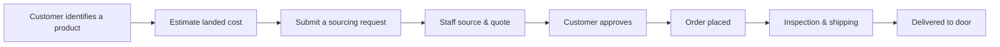

Throughout, both sides can chat in real time and start audio/video calls, and
every important event lands as an in-app notification and (when enabled) a
push notification on the customer's device.

The frontend surface has three audiences:

| Surface | Audience | What it offers |
|---------|----------|----------------|
| Marketing site (`/`) | Visitors | Product explainer, how-it-works, FAQs, landed-cost calculator, contact form |
| Customer portal (`/overview`, `/requests`, `/quotes`, `/chat`, …) | Customers | Submit requests, decide on quotes, track orders & shipments, chat & call, notifications, profile |
| Staff console (`/admin`) | Staff | Request pipeline, quote builder, orders, shipments, inspections, customers, suppliers, analytics, messages & calls, notifications, settings |

---

## Who it is for

- **Customers** — importers, resellers and retailers in Africa who want
  predictably priced goods from China without babysitting suppliers, freight
  forwarders or clearing agents.
- **Staff** — the Fayfort sourcing team that researches suppliers, negotiates
  quotes, organises quality inspections and manages shipping per request.

---

## Key features

- **Landed-cost calculator** — itemised estimate engine (product, freight,
  insurance, packaging, duty, clearance, FX buffer, service fee).
- **Sourcing pipeline** — requests move through a validated status workflow,
  with quotes generated per request and a full request timeline.
- **Quote decisions** — customers approve, decline, or let quotes expire from
  the portal.
- **Orders, shipments and inspections** — staff advance orders through payment,
  purchasing, supplier processing, inspection, warehousing and shipping.
- **Real-time chat** — per-thread WebSocket messaging with typing indicators,
  attachments, unread counts and instant wake-up on new messages.
- **Audio & video calls** — WebRTC media via LiveKit, with ringing coordinated
  over the same chat WebSocket; missed calls become notifications.
- **Web Push notifications** — service-worker push (VAPID) so events reach a
  device even when the tab is closed.
- **Google sign-in (PKCE)** — one-tap auth with a cold-start-tolerant exchange,
  plus email/password with argon2id hashing.
- **Admin console & analytics** — KPIs, pipeline views, activity feed, global
  search, notifications.
- **PWA** — installable, offline-capable static shell with a service worker.

---

## Tech stack

| Layer | Technology |
|-------|-----------|
| Frontend | Next.js 16 (App Router), React 19, TypeScript, Tailwind CSS v4, pnpm |
| Backend | Go 1.22, stdlib `net/http` (Go 1.22 routing patterns) |
| Database | SQLite via `modernc.org/sqlite` (pure Go, no cgo), single file |
| Realtime | `gorilla/websocket` hub (typing, message wake-ups, call signalling) |
| Media calls | LiveKit (client SDK + server-sdk token minting) |
| Auth | Google OAuth (authorization-code + PKCE), session tokens in cookies |
| Passwords | argon2id (`golang.org/x/crypto/argon2`) |
| Push | Web Push / VAPID (`web-push` library behind `internal/push`) |
| Hosting | Render (two services: web + backend), Dockerfiles included |

---

## System architecture

The frontend never talks to the database. All state lives behind the Go API:

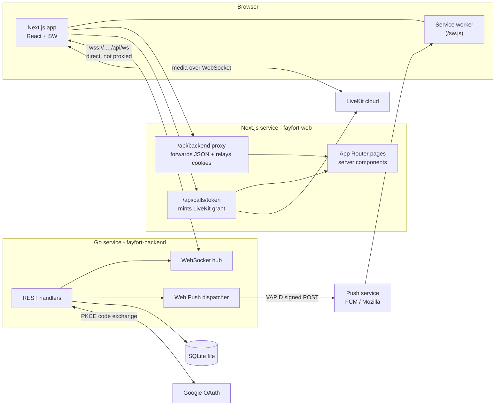

Key details:

- **Browser → backend WebSocket is direct.** Next's `/api/backend` route handler
  can relay HTTP but not WebSocket upgrades, so the chat socket connects
  straight to `wss://…/api/ws`. The browser authenticates with a one-time token
  minted over the HTTP proxy (`POST /api/ws-token`), because the session cookie
  alone cannot cross the host gap.
- **The proxy preserves the auth boundary.** Client components call
  `/api/backend/…`; the route handler forwards to the Go service and relays the
  backend's `Set-Cookie` so the session cookie stays an opaque HttpOnly token.
- **Business data, sessions and push subscriptions live in one SQLite file** on
  the backend's disk.

---

## Repository layout

```text
fayfort/
├── backend/                      # Go service
│   ├── cmd/server/main.go        # entrypoint: flags, seeding, HTTP server
│   ├── internal/
│   │   ├── auth/                 # argon2id hashing + session token generation
│   │   ├── domain/               # entities, status vocabulary, estimate engine
│   │   ├── httpapi/              # routes, middleware, handlers + WS hub
│   │   ├── push/                 # VAPID sender, async dispatcher, fan-out
│   │   └── store/                # SQLite schema, queries, demo seed
│   ├── Dockerfile
│   └── run.sh                    # dev: in-memory DB on :3100
│
└── frontend/                     # Next.js app
    ├── app/                      # App Router pages, route handlers, middleware
    │   ├── (marketing)/          # landing, about, faq, contact, privacy, terms
    │   ├── admin/                # staff console (+ /admin/login)
    │   ├── overview|dashboard|requests|quotes|chat|notifications|profile|settings
    │   ├── api/backend/[...path] # HTTP proxy → Go
    │   ├── api/calls/token/      # LiveKit room grant
    │   └── manifest.ts           # PWA manifest
    ├── components/
    │   ├── admin/                # console UI (inbox, quote builder, …)
    │   ├── marketing/            # landing-page sections
    │   ├── portal/               # customer portal UI
    │   ├── pwa/                  # SW provider, install prompt, push toggle/nudge
    │   └── ui/                   # shared primitives + call overlay/state machine
    ├── lib/
    │   ├── backend.ts            # typed Go API client (server-only)
    │   ├── chat-socket.ts        # reconnecting WebSocket client
    │   ├── call-session.ts       # LiveKit session wrapper
    │   ├── google-auth.ts        # PKCE Google flow
    │   └── push.ts / call-notify.ts
    ├── public/sw.js              # service worker
    ├── proxy.ts                  # middleware: route guard by session role
    ├── next.config.ts
    └── Dockerfile
```

---

## Data model

Single-file SQLite schema (defined in `backend/internal/store/db.go`). The
entities mirror the status vocabulary in `backend/internal/domain/models.go`,
which is kept byte-for-byte in sync with the frontend constants so clients and
server never disagree on IDs or statuses.

| Entity | Stores | Notable relationships |
|--------|--------|----------------------|
| `users` | Sign-in accounts (staff/customer), argon2id hash | owns sessions |
| `sessions` | Opaque bearer tokens, expiry | → `users` |
| `customers` | CRM records, pipeline value, status | referenced by requests/quotes/orders |
| `suppliers` | Verified vendor directory, reliability, MOQ, terms | referenced by quotes |
| `sourcing_requests` | Product, quantity, budget, status, timeline | → customer; → quote |
| `quotes` | Supplier offer, value, margin, expiry, decision | → request |
| `orders` | Placed orders, unit price, value, status | → request |
| `shipments` | Freight legs (FCL/LCL/Air), carrier, ETA | → request |
| `inspections` | QC schedule, inspector, result | → order |
| `threads` | Per-customer support conversation + messages | keyed by thread id |
| `admin_notifications` / `customer_notifications` | In-app feed entries | role-scoped |
| `push_subscriptions` | Device endpoints + VAPID keys | tagged by account email/role |
| `activity` | Audit-style event feed | used by console timeline |

Unread tracking is bidirectional: `threads.unread` counts customer messages
awaiting staff, `threads.customer_unread` counts staff replies awaiting the
customer.

---

## How it works — core flows

### 1. Customer journey

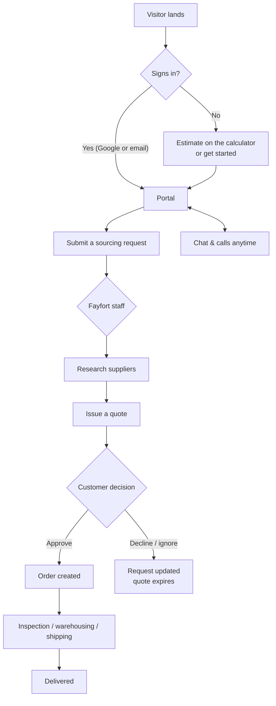

### 2. Landed-cost estimation engine

Both the marketing calculator and the onboarding flow use
`domain.ComputeEstimate` (Go) — the same maths as `lib/estimate.ts`, so the
price a visitor sees is the one the backend later uses.

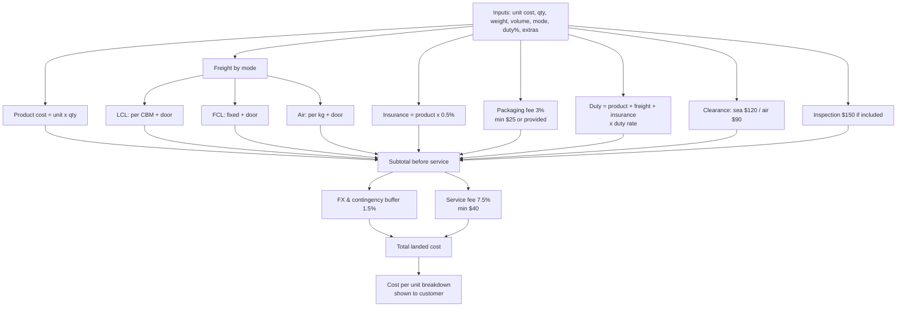

### 3. Authentication

Fayfort supports two sign-in paths. Both converge on the same session cookie
(`fayfort_session`), set by the Go backend itself.

**Email / password**

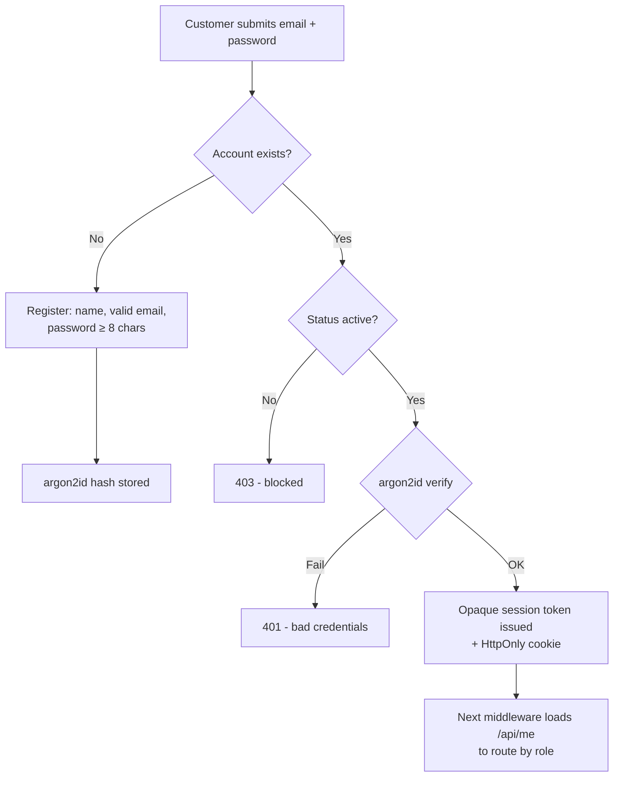

**Google (OAuth authorization-code + PKCE)**

The browser never sees a long-lived ID token. It opens a same-origin popup,
Google returns a single-use authorization code, and the backend exchanges it
server-side for an ID token, validates audience/nonce/expiry/issuer, then
provisions or links the account.

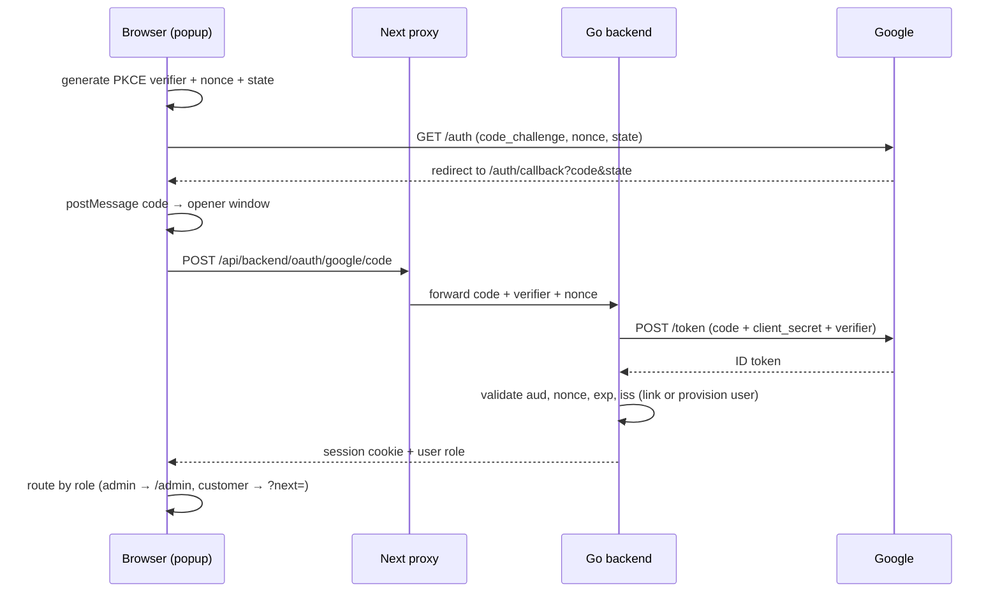

### 4. Sourcing request lifecycle

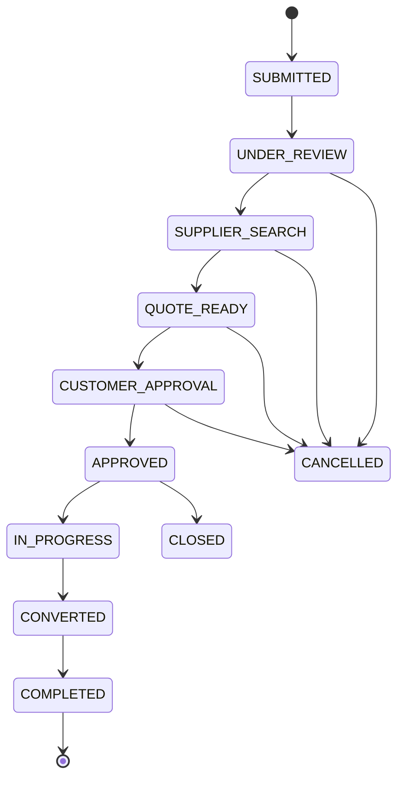

Staff move requests through validated transitions and can issue a quote from any
request detail page (the `quote-builder` component). Every transition writes to
the activity feed and, in the portal, updates the customer's status timeline
and notification list.

### 5. Quote → order → delivery

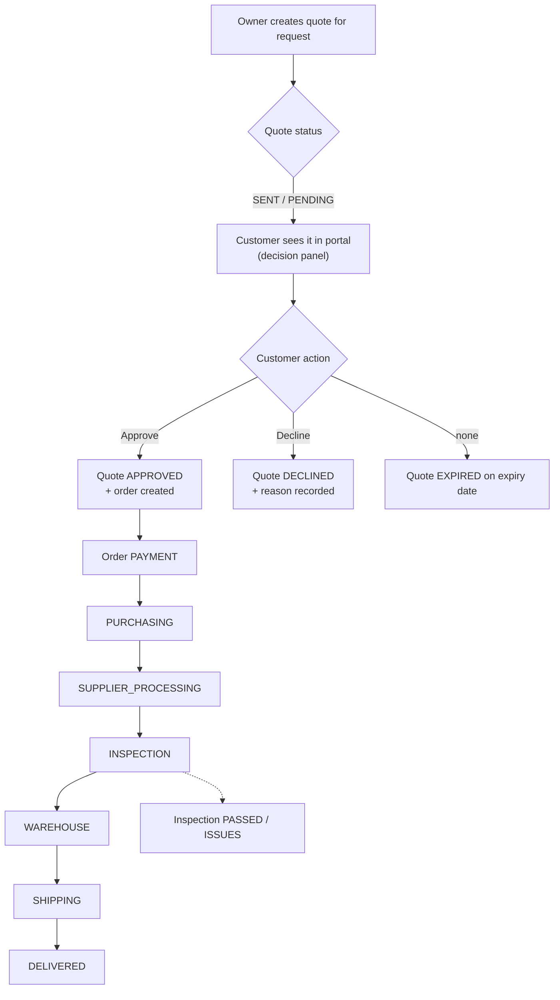

Shipments track independent freight statuses (`BOOKED → IN_TRANSIT → CUSTOMS →
DELIVERED`), and the customer's dashboard shows the tracking view keyed by
request.

### 6. Real-time chat

Chat is per-conversation (one thread per customer). Both the staff console and
the customer portal hold a `ChatSocket` that subscribes to every thread in
view. The Go hub is deliberately stateless — missed frames are harmless because
a `message` wake-up always triggers a full refetch.

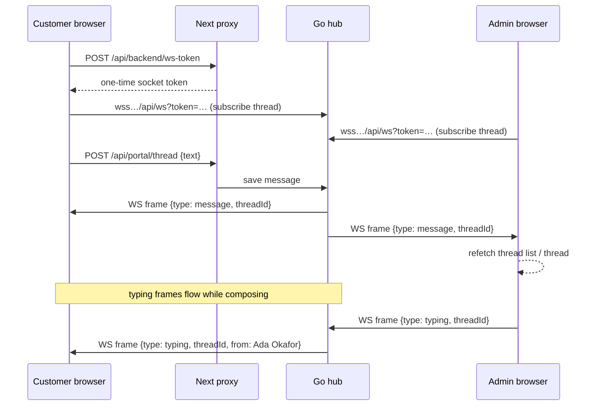

New threads poke the whole staff console (`type: threads`) so a brand-new
customer conversation appears without a reload. `threads.customer_unread`
increments on every staff reply and drives the portal badge.

### 7. Audio / video calls

Calls split responsibilities deliberately: **LiveKit carries the media** and
**the chat WebSocket carries the ringing**. A call therefore inherits the exact
per-thread authorisation of the messages around it, and the LiveKit room grant
is scoped to a single room derived from the thread id (customers may only
request a token for their own thread).

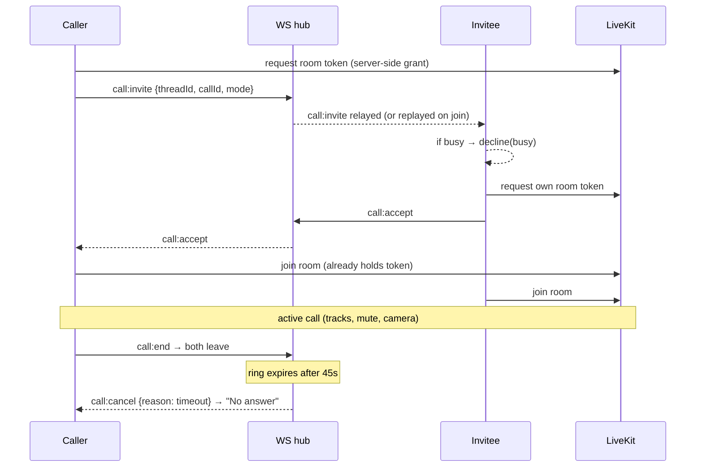

The hub tracks ringing calls in memory only: a late subscriber still receives
the existing ring, a disconnecting caller's phone stops ringing, and unanswered
invites expire after 45 seconds. If the invitee is **not** live on the thread
when the invite arrives (or the ring expires unanswered), the backend fires a
Web Push — see below.

### 8. Notifications & Web Push

There are three complementary channels:

1. **In-app notifications** — `admin_notifications` / `customer_notifications`
   tables surfaced in both portals' notification centres.
2. **WebSocket wake-ups** — instant refresh while a chat page is open.
3. **Web Push (VAPID)** — OS-level banner even with the app closed, plus missed
   call notices.

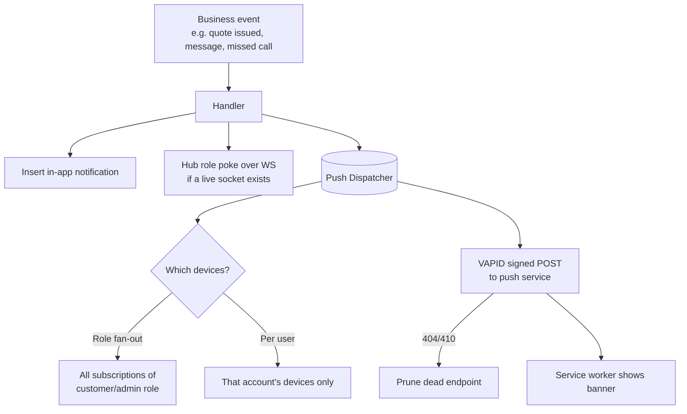

`internal/push` keeps business fan-out role-scoped so a customer can never
trigger a notification on someone else's device, the per-user path is reserved
for things like "this call was not answered" (addressed to the caller by email),
and delivery is best-effort with retries so a slow push service never delays the
action that produced it.

---

## Real-time layer: WebSocket protocol

Endpoint: `wss://<backend>/api/ws?token=<one-time token>`.
The browser connects directly (not through the proxy). The token is minted by
`POST /api/ws-token` (2-minute TTL, single use) and re-minted on every
reconnect; reconnect uses capped exponential backoff (500 ms → 5 s).

**Client → server frames:**

| Type | Payload | Purpose |
|------|---------|---------|
| `subscribe` | `threadId` | receive events for a thread |
| `unsubscribe` | `threadId` | stop receiving |
| `typing` | `threadId` | typing indicator (debounced 400 ms) |
| `call:invite` | `threadId, callId, mode` | ring the other side |
| `call:accept` | `threadId, callId` | answer |
| `call:decline` | `threadId, callId, reason?` | busy/declined |
| `call:cancel` | `threadId, callId, reason?` | withdraw a ring |
| `call:end` | `threadId, callId, reason?` | hang up |

**Server → client frames:**

| Type | Payload | Purpose |
|------|---------|---------|
| `typing` / `stopped` | `threadId, from, role` | live indicator |
| `message` | `threadId` | "a new message landed — refetch" |
| `threads` | — | thread list changed (new conversation) |
| `call:invite` | `threadId, callId, mode, from, role` | ring card (replayed to late joiners) |
| `call:accept` / `call:decline` / `call:cancel` / `call:end` | `callId, threadId, reason?` | call lifecycle |

`from`/`role` on call frames are stamped server-side from the authenticated
socket, so they cannot be spoofed by the browser. Only loopback hosts and the
deployed frontend origin are accepted by the upgrade gate (configurable via
`WS_ALLOWED_ORIGINS`).

---

## HTTP API

All JSON. Sessions arrive as the `fayfort_session` cookie or
`Authorization: Bearer <token>`. Admin routes additionally require
`role == "admin"`.

### Health & auth

| Method | Path | Notes |
|--------|------|-------|
| `GET` | `/api/health` | liveness probe |
| `POST` | `/api/auth/register` | `{name, email, password}` |
| `POST` | `/api/auth/login` | `{email, password}` → token + user |
| `POST` | `/api/auth/logout` | revoke session |
| `GET` | `/api/me` | current user |
| `POST` | `/api/oauth/google` | ID-token fallback path |
| `POST` | `/api/oauth/google/code` | PKCE authorization-code exchange |

### Marketing & estimate

| Method | Path | Notes |
|--------|------|-------|
| `POST` | `/api/estimate/check` | full landed-cost engine |
| `POST` | `/api/estimate/simplified` | estimate with sensible defaults |
| `POST` | `/api/contact` | contact form |
| `POST` | `/api/sourcing-requests` | create a request (public) |

### Customer portal

| Method | Path | Notes |
|--------|------|-------|
| `GET` | `/api/portal/requests` | the user's requests + timeline |
| `GET` | `/api/portal/quotes` | the user's quotes + decision panel |
| `POST` | `/api/portal/quotes/{requestId}/decision` | approve/decline |
| `GET` | `/api/portal/notifications` | feed |
| `GET` / `POST` | `/api/portal/thread` | the user's chat thread |
| `GET` | `/api/portal/thread/unread` | unread counter |
| `POST` | `/api/portal/thread/read` | mark thread read |
| `GET` | `/api/portal/profile` / `/overview` | identity + summaries |
| `POST` | `/api/portal/notifications/read` | mark all read |
| `POST` | `/api/portal/notifications/{id}/read` | mark one read |

### Admin console

| Method | Path | Notes |
|--------|------|-------|
| `GET` | `/api/admin/dashboard` | KPIs, pipeline, charts, activity |
| `GET` | `/api/admin/requests` | pipeline queue |
| `GET` | `/api/admin/requests/{id}` | request detail + quotes + timeline |
| `PATCH` | `/api/admin/requests/{id}/status` | move the request through the workflow |
| `POST` | `/api/admin/requests/{id}/quote` | issue a quote |
| `GET` | `/api/admin/quotes` / `orders` / `shipments` / `inspections` | lists |
| `POST` | `/api/admin/orders/{id}/advance`, `PUT …/status` | order workflow |
| `GET` | `/api/admin/customers` / `suppliers` | directories |
| `GET` | `/api/admin/messages` | support threads |
| `GET` | `/api/admin/messages/unread` | global unread count |
| `POST` | `/api/admin/messages/{id}/reply` | thread reply |
| `POST` | `/api/admin/messages/{id}/read` | mark thread read |
| `GET` | `/api/admin/notifications` | feed + mark read |
| `GET` | `/api/admin/analytics` / `activity` / `search?q=` / `settings` | derived views |

### Realtime & push

| Method | Path | Notes |
|--------|------|-------|
| `GET` | `/api/ws` | WebSocket (token or session) |
| `POST` | `/api/ws-token` | one-time socket token |
| `GET` | `/api/push/public-key` | VAPID public key for subscriptions |
| `POST` | `/api/push/subscribe` | register a device |
| `POST` | `/api/push/unsubscribe` | remove a device (owner only) |
| `POST` | `/api/push/test` | deliver test notification to own devices |

---

## Environment variables

### Backend (`backend/internal/push/push.go`, `main.go`, `ws.go`)

| Variable | Default | Notes |
|----------|---------|-------|
| `GOOGLE_CLIENT_ID` / `GOOGLE_CLIENT_SECRET` | — | required for Google sign-in |
| `FAYFORT_VAPID_PUBLIC_KEY` | generated | **set stable keys in production** |
| `FAYFORT_VAPID_PRIVATE_KEY` | generated | (ephemeral keys lose subscriptions on restart) |
| `FAYFORT_VAPID_SUBJECT` | `mailto:support@fayfort.com` | push service contact |
| `FAYFORT_PUSH_TIMEOUT` | `10s` | per-attempt push HTTP timeout |
| `WS_ALLOWED_ORIGINS` | deployed frontend | extra WebSocket origins (comma-separated) |

### Frontend (`frontend/.env.local`, server-side unless prefixed `NEXT_PUBLIC_`)

| Variable | Default | Notes |
|----------|---------|-------|
| `BACKEND_URL` | `http://127.0.0.1:8080` | Go service base URL (also used for the WS endpoint) |
| `NEXT_PUBLIC_GOOGLE_CLIENT_ID` | — | OAuth client id for Google sign-in |
| `NEXT_PUBLIC_APP_URL` | — | canonical site URL |
| `NEXT_PUBLIC_IS_DEMO` | unset | `"true"` enables demo helpers |
| `LIVEKIT_URL` / `LIVEKIT_API_KEY` / `LIVEKIT_API_SECRET` | — | without all three, calls are unavailable (`503`) |

---

## Getting started (local development)

Prerequisites: Go 1.22+, Node 22+, pnpm.

**1. Backend** — run from `backend/`:

```sh
cd backend
./run.sh                 # in-memory DB on 127.0.0.1:3100
# or persist data:
go run ./cmd/server -db ./fayfort.db -addr :8080
```

**2. Frontend** — run from `frontend/`:

```sh
cd frontend
pnpm install
echo "BACKEND_URL=http://127.0.0.1:3100" > .env.local   # match the backend
pnpm dev                # http://localhost:3000
```

The route guard (`proxy.ts`) protects customer and admin pages by fetching
`/api/me` and checking the role; after signing in, navigation lands each role
in the right place.

**3. Optional calls** — add the three `LIVEKIT_*` variables to `.env.local`.

---

## Demo accounts

Seeded on every backend boot (see `backend/cmd/server/main.go`):

| Account | Email | Password | Role | Linked identity |
|---------|-------|----------|------|-----------------|
| Admin | `admin@fayfort.com` | `admin123` | admin | Ada Okafor (STF-001) |
| Demo customer | `demo@example.com` | `demo1234` | customer | David Green (C-002) |

The larger demo dataset (quotes, requests, shipments, suppliers, threads…) is
loaded only with `-seed` and is skip-if-populated. Production intentionally
boots on an empty dataset so the console shows only real records and the
accounts above stay available.

---

## Testing

```sh
# Backend — unit + integration (includes WS hub, calls, push, auth, API)
cd backend
go test ./...
go vet ./...

# Frontend — unit (vitest), lint, typecheck, production build, e2e smoke
cd frontend
pnpm test
pnpm lint
pnpm typecheck
pnpm build
pnpm test:e2e          # expects a backend on :3100 (run backend/run.sh)
```

The `e2e/smoke.mjs` probe exercises auth, request creation, quotes and chat
against a live dev backend.

---

## Deployment

Both services are containerised and deployed to Render (two services, one
GitHub repo).

**Backend** (`backend/Dockerfile`): builds a static Go binary, runs as a
non-root user, persists SQLite at `/data/fayfort.db`. Health check:
`/api/health`.

**Frontend** (`frontend/Dockerfile`): installs deps, builds with
`NEXT_PUBLIC_GOOGLE_CLIENT_ID`/`NEXT_PUBLIC_APP_URL` build args, runs
`pnpm start` on `:3000`.

Production settings that matter:

- **Set stable VAPID keys** on the backend, and `WS_ALLOWED_ORIGINS` pointing at
  the deployed frontend (the browser's WebSocket upgrade is cross-origin and
  rejected by default for non-loopback hosts).
- **LiveKit credentials** on the frontend for calls; Google OAuth client + the
  authorization callback origin; `BACKEND_URL` pointing at the backend host.
- Each deploy/restart creates a fresh SQLite file on the free tier's ephemeral
  disk, so push subscriptions re-register when a device visits again and are
  keyed to the stable VAPID pair.
- Serve over HTTPS everywhere: `Notification` permission and PWA/push only work
  in secure contexts.

---

## Security notes

- Passwords are stored as **argon2id** hashes; session tokens are opaque,
  random, stored server-side with a 7-day expiry, and set as HttpOnly,
  SameSite=Lax cookies.
- Google sign-in validates **audience, nonce, expiry and issuer** server-side
  and requires a verified email; the PKCE exchange means the browser never
  handles an ID token.
- The `/api/backend` proxy keeps the Go session cookie opaque to client
  JavaScript and relays it unchanged.
- WebSocket call frames are **stamped server-side** (`from`, `role`) and the
  upgrade origin is restricted; a single-use short-lived token authenticates
  sockets.
- Chat is authorised **per-thread**: staff may access threads they can see;
  customers only their own thread, and the LiveKit token route enforces the
  same boundary for calls.
- Deferred hardening — rate limiting on login/register, 2FA, honeypot on
  registration — is designed to land in the Go service.